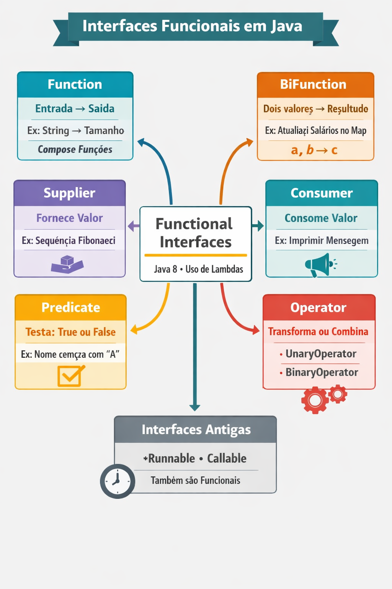

# Functional Interfaces POC

POC desenvolvida em Java 21 com o objetivo de explorar os principais conceitos de Functional Interfaces e programação funcional no Java.

## Objetivos

Durante esta POC foram estudados os seguintes conceitos:

- Criação de Functional Interfaces
- Uso de expressões lambda
- Method Reference
- Encadeamento de funções
- Processamento funcional com Streams
- Uso das principais interfaces funcionais da JDK

## Interfaces funcionais abordadas

- `Function`
- `BiFunction`
- `Predicate`
- `Consumer`
- `BiConsumer`
- `Supplier`
- `BinaryOperator`

## Conceitos praticados

- Lambdas
- `Stream API`
- `filter`
- `map`
- `forEach`
- `andThen`
- `Method Reference (::)`

## Tecnologias

- Java 21

## Referências

- https://docs.oracle.com/javase/8/docs/api/java/util/function/package-summary.html
- https://www.baeldung.com/java-8-functional-interfaces